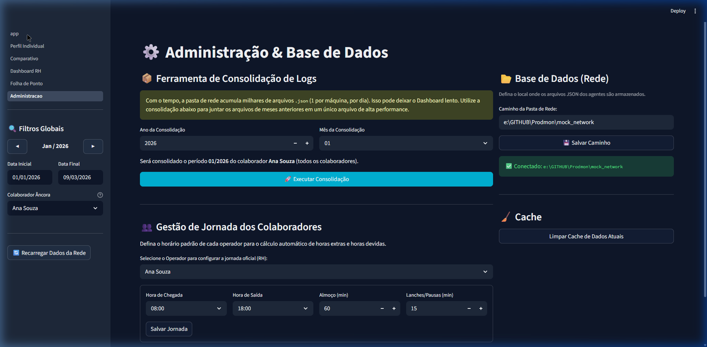
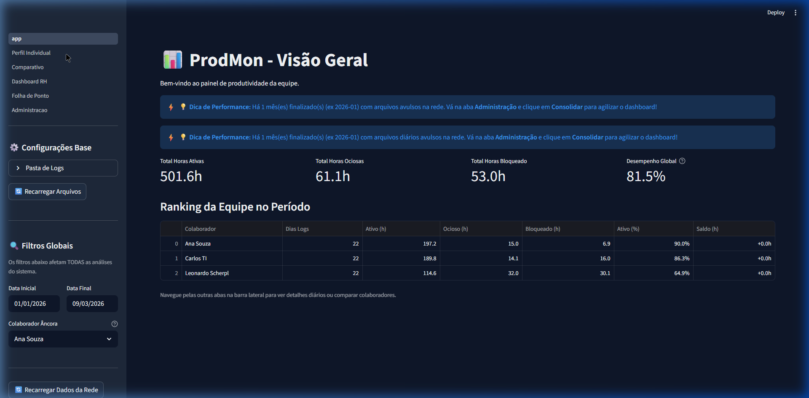
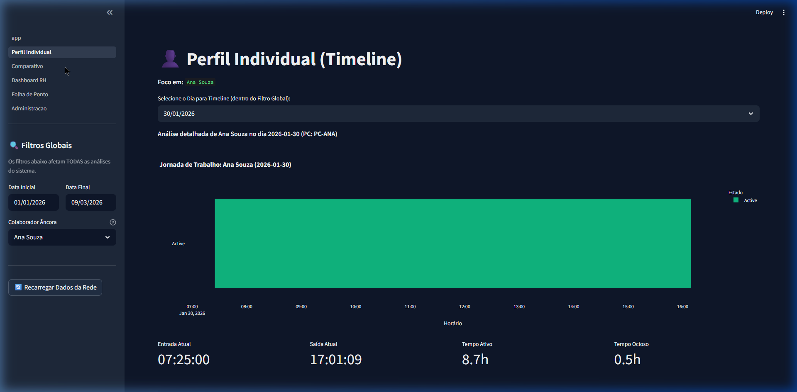
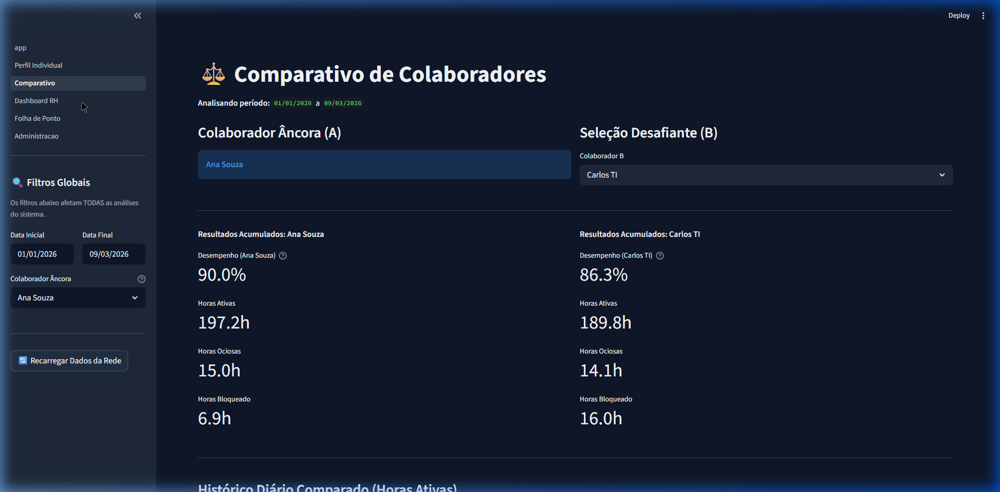
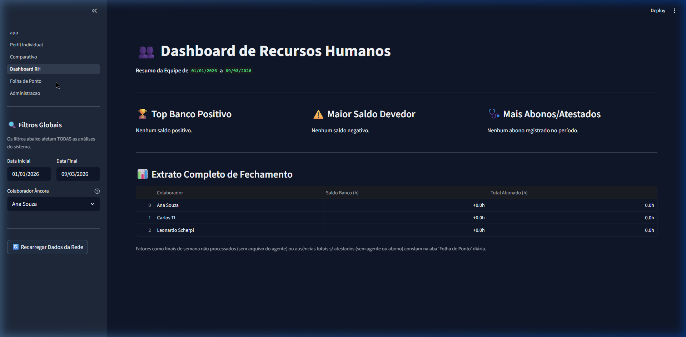
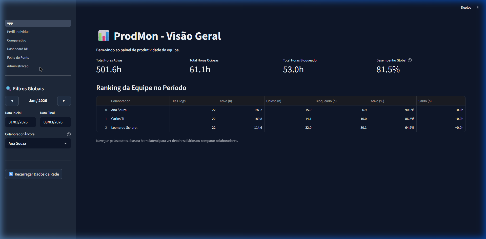

# ProdMon: Sistema de Produtividade e Controle de Ponto
### Agente de Monitoramento + Dashboard BI para Gestores (Windows 10/11)

---

> **Autor:** Leonardo Scherpl — Contador · [Minas Contabilidade](https://minascontabilidade.com.br)

---

## 🌟 O que é o ProdMon?

O **ProdMon** é um sistema completo dividido em duas partes:
1. **O Agente Silencioso (Para a equipe):** Um pequeno programa que roda escondido no computador de cada funcionário. Ele anota a hora que o PC foi ligado (Entrada), a hora que foi desligado (Saída), e entende quando o funcionário estava trabalhando (mouse/teclado ativos) ou ausente (tela bloqueada ou inativo).
2. **O Dashboard BI (Para o Gestor/RH):** Um painel visual interativo onde você vê o ranking da equipe, compara funcionários, apura banco de horas, faltas e lança atestados médicos (Controle de Ponto).

Tudo isso funciona **sem internet externa**. Os dados ficam salvos em uma pasta compartilhada dentro da própria rede da sua empresa, garantindo total privacidade e segurança.

---

## 📸 Screenshots do Dashboard

### Visão Geral — Ranking da Equipe


### Perfil Individual — Timeline Gantt do Colaborador


### Comparativo — Âncora vs Desafiante


### Dashboard RH — Destaques de Banco de Horas


### Folha de Ponto — Extrato Diário com Justificativas


### Administração — Consolidação + Configuração de Rede


---

## 🚀 Passo a Passo de Instalação para Leigos

Siga esta receita de bolo para colocar o ProdMon para funcionar no seu escritório!

### Passo 1: Preparar a "Pasta do Servidor"
O sistema precisa de um lugar central na sua rede onde todos os computadores vão depositar os dados.
1. Vá no servidor da sua empresa (ou no computador principal).
2. Crie uma pasta chamada, por exemplo, `ProdMonData` (Ex: `C:\ProdMonData`).
3. Clique com o botão direito nela > Propriedades > Compartilhamento e **Compartilhe** a pasta para que todos os funcionários tenham acesso de Leitura e Gravação.
4. Anote o caminho na rede dessa pasta. Vai ser algo parecido com `\\SERVIDOR\ProdMonData` ou `Z:\ProdMonData`.

### Passo 2: Configurar o Sistema Base
1. Baixe os arquivos do ProdMon (este repositório).
2. Abra o arquivo `config.py` com o Bloco de Notas.
3. Encontre as seguintes linhas e altere:
   ```ini
   install_mode = 'client'        # Deixe assim para instalar na equipe
   network_dir = '\\SERVIDOR\ProdMonData' # <-- COLOQUE O CAMINHO DA SUA PASTA AQUI
   ```
4. Salve o arquivo.

### Passo 3: Instalar nos Computadores da Equipe (O Agente)
Faça isso no computador **de cada funcionário**:
1. Copie os arquivos do ProdMon (com o `config.py` já alterado no Passo 2) para o computador do funcionário (exemplo, num pen-drive).
2. Clique com o **botão direito** no arquivo `install.bat` e escolha **"Executar como Administrador"**.
3. O instalador vai abrir uma tela preta e perguntar o **Nome do Funcionário** (ex: João Silva). Digite e aperte Enter.
4. Pronto! O programa vai se instalar silenciosamente e já está rodando. Pode apagar os arquivos do pen-drive.

### Passo 4: Instalar no Computador do Gestor/RH (O Dashboard BI)
Faça isso **apenas** no seu computador (ou de quem vai ver os relatórios):
1. No seu computador, abra o `config.py` novamente.
2. Mude o modo de instalação de `client` para `server`:
   ```ini
   install_mode = 'server'
   network_dir = '\\SERVIDOR\ProdMonData'
   ```
3. Salve o arquivo.
4. Clique com o **botão direito** no `install.bat` e escolha **"Executar como Administrador"**.
5. Ele vai instalar os pacotes gráficos pesados (demora alguns minutos).
6. Quando terminar, vai criar um ícone verde na sua Área de Trabalho chamado **"Abrir Dashboard ProdMon"**.

---

## 📊 Como usar o Dashboard (Painel do Gestor)

Deu dois cliques no ícone **"Abrir Dashboard ProdMon"**? Uma aba do seu navegador de internet vai abrir com o sistema.

### Filtro Global (Menu Lateral Esquerdo)
O painel lateral é o centro de comando de todo o sistema. Nele você define:
- **◀ Mês/Ano ▶**: Botões rápidos para navegar entre meses. Ao clicar, a Data Inicial e Final se ajustam automaticamente para o primeiro e último dia do mês selecionado.
- **Data Inicial / Data Final**: Para ajuste fino de qualquer período personalizado.
- **Colaborador Âncora**: A pessoa que será o foco de todas as análises individuais e comparativas. Trocar o Âncora aqui reflete instantaneamente em todas as abas do sistema.

### Abas do Sistema

| Aba | Eixo | Descrição |
|---|---|---|
| **Visão Geral** | Produtividade | Ranking da equipe por horas ativas, ociosas e saldo de banco de horas no período filtrado. |
| **Perfil Individual** | Produtividade | Timeline Gantt do Colaborador Âncora mostrando minuto a minuto quando chegou, almoçou e saiu. |
| **Comparativo** | Produtividade | Compara o Colaborador Âncora (A) com um segundo colaborador (B) lado a lado. |
| **Dashboard RH** | Controle de Ponto | Destaques da equipe: quem acumula mais horas extras, quem deve mais horas, quem tem mais atestados. |
| **Folha de Ponto** | Controle de Ponto | Extrato diário do Âncora para o período global. Permite lançar Atestados, Faltas e Abonos. |
| **Administração** | Configuração | Consolidação de logs antigos (performance), configuração de jornada oficial e caminho da pasta de rede. |

---

## 🛠️ Informações Técnicas para TI

### Modos de Detecção de Produtividade do Agente
O arquivo `prodmon_agent.py` monitora o teclado/mouse usando chamadas diretas à API do Windows `ctypes.windll`, não utilizando keyloggers para garantir privacidade absoluta do conteúdo digitado.
1. **Win+L (Lock):** O evento `WM_WTSSESSION_CHANGE` percebe a tela bloqueada da máquina e pausa a contagem de horas produtivas imediatamente.
2. **Afastei da Mesa (Idle):** Se o mouse/teclado parar, retroage após X minutos (definidos p/ desligar o monitor via `powercfg`) e computa o gap como `Idle`.

### Segurança
- **Cópia Atômica para Rede:** Arquivos são copiados via `.tmp` + `os.replace()` para evitar corrupção se a rede cair durante a transferência.
- **Sanitização de Input:** O `install.bat` filtra caracteres especiais (`[`, `]`, `{`, `}`, `=`) do nome do operador para prevenir injeção no `config.py`.
- **Sem Keylogger:** Apenas o _estado_ (ativo/ocioso/bloqueado) é registrado da sessão, jamais o conteúdo digitado.

### Arquitetura de Pastas na Rede
```text
\\SERVIDOR\ProdMonData\
├── PC-JOAO\
│   └── PC-JOAO_2026-03-09.json      (Logs diários do Agente Cliente)
├── consolidado_2026_02.json         (Arquivos gerados na aba Administração reduzindo leitura)
├── schedules_config.json            (Ajustes de horário cadastrados no BI)
├── justifications_config.json       (Banco de dados do RH para atestados/abonos)
└── dashboard_config.json            (Caminho da rede salvo pelo Dashboard)
```

### Stack Tecnológica
| Componente | Tecnologia |
|---|---|
| Agente | Python 3.8+, `ctypes`, `pywin32` |
| Dashboard | Streamlit, Pandas, Plotly |
| Armazenamento | Arquivos JSON em pasta de rede (SMB) |
| Segurança | Cópia atômica, sanitização de input |

### Desinstalação
Nas máquinas cliente, execute `uninstall.bat` como Administrador. O script varrerá os processos via `wmic`, encerrará o agente Python sem fechar outros scripts rodando no computador, varrerá as chaves de Run no Registro do Windows e oferecerá a deleção dos arquivos ocultos na raiz `C:\ProgramData\ProdMon`.
